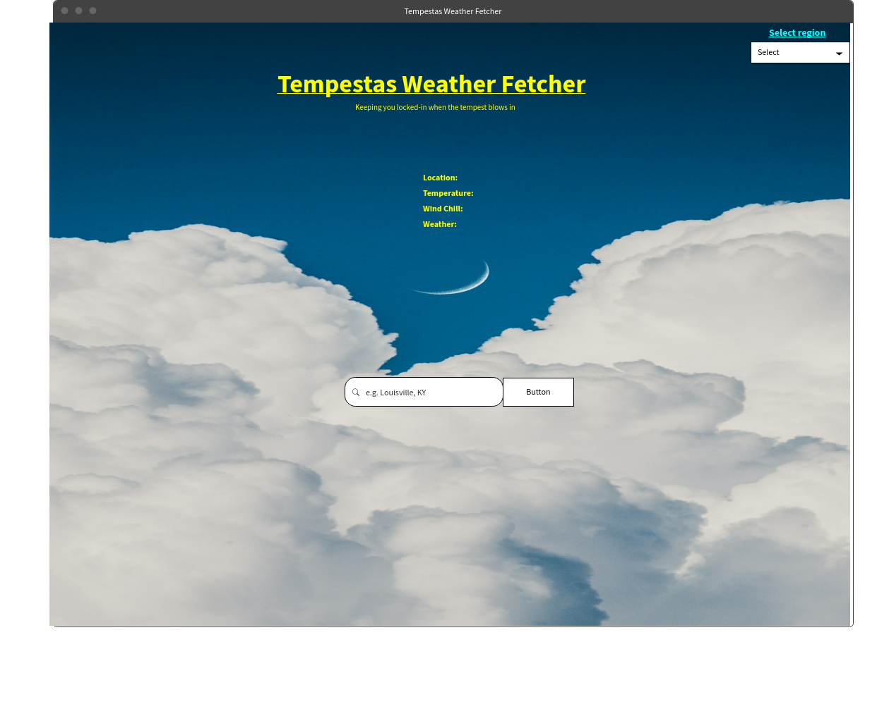

<link rel="stylesheet" href="https://pro.fontawesome.com/releases/v5.10.0/css/all.css" integrity="sha384-AYmEC3Yw5cVb3ZcuHtOA93w35dYTsvhLPVnYs9eStHfGJvOvKxVfELGroGkvsg+p" crossorigin="anonymous"/>

# Tempestas Weather Fetcher 
*Keeping you locked-in when the tempest blows in!*

## Powered by:
<i class="fab fa-js-square"></i>
<i class="fab fa-css3-alt"></i>
<i class="fab fa-html5"></i>

## Features:
* Allow user to input, fetch, and display data from the OpenWeather API
* Allow user to return multiple days worth of data with one AJAX request (future)
* Allow user to select language region with dropdown (future)

## User Stories:
* As a user I can fetch data from the OpenWeather API using a text string that I input and manipulate a button to submit.

* As a user I would like to be able to fetch more than one day of data, so that I may be better prepared for the coming weather patterns and monitor trends.

* As a user I would like to be able to set my region for language, so that I may better navigate and understand the website.

* As a user I would like to be able to set a default locale, so that I don't have to manually input my location everytime I vist the application.

## Wireframe:

## Future Goals:
* Region select for language
* Fetch multiple days of data
* Animations
* Clean up styling
